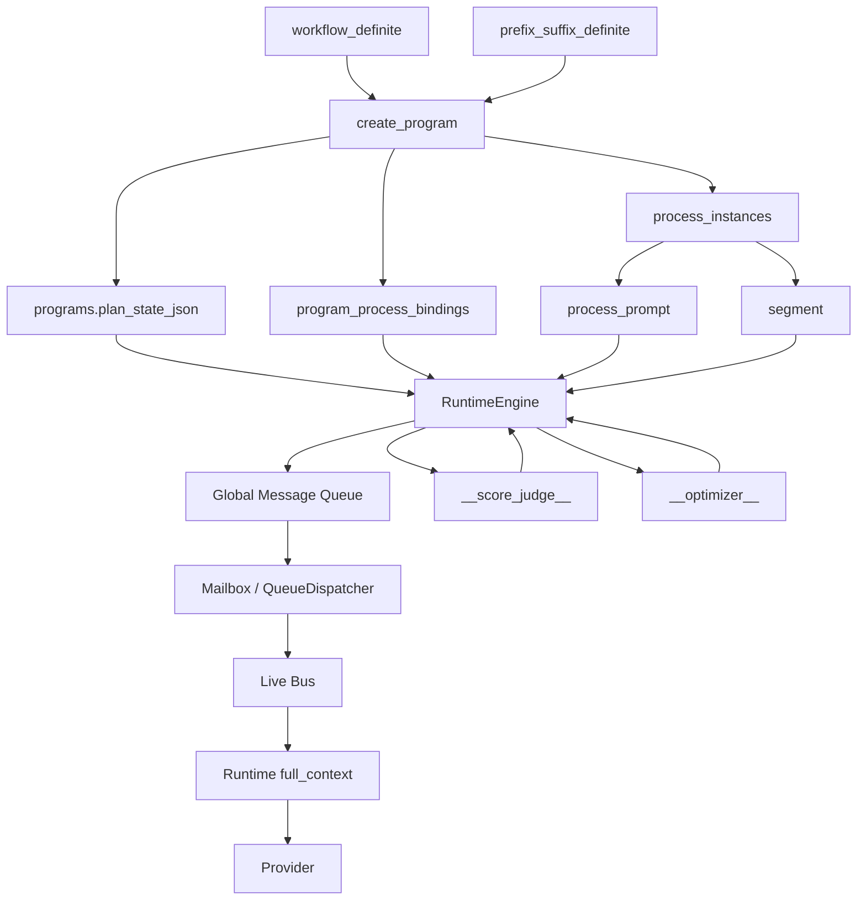

# Form_zero

`Form_zero` 是一个把多代理协作拆成“真实进程、真实消息、真实段落、真实绑定关系”的运行时系统。它不是传统意义上只维护一段对话历史的 agent wrapper，而是把协作过程显式建模为 `workflow -> program -> process -> segment` 四层结构：`workflow` 提供实例化模板，`program` 持有当前运行中的 slot 规划，`process` 是可轮换、可解绑、可继承上下文的执行实体，`segment` 则是唯一可追踪的上下文物化单位。当前仓库的主线实现位于 `Form_zero2/`，包名仍为 `form_zero`。

## 项目目标

这个项目解决的核心问题不是“让一个模型说得更像助手”，而是“让一组有角色分工的进程在统一 runtime 中协作，并且把协作状态做成可查询、可重建、可优化的系统”。因此它有三个非常鲜明的设计原则：

1. 运行时状态优先于 prompt 魔法。  
   所有重要状态都尽量落到数据库与结构化 runtime state，而不是散落在临时字符串里。
2. 进程是第一公民。  
   一个 slot 当前绑定哪个 process、它的 lineage、它的 `process_prompt`、它的 live bus 和 sealed history，都是明确对象。
3. 优化链路与业务链路并存。  
   普通 slot 负责任务执行，隐藏 slot `__optimizer__` 与 `__score_judge__` 负责评分、局部异常观察与全局 reprompt。

## 架构总览



如果用一句话概括：`Form_zero` 先用数据库定义“这个系统有哪些角色”，再用 runtime 驱动“这些角色之间如何发消息、何时封段、何时优化、何时轮换进程”。

## 为什么它不是普通 Agent 框架

很多 agent 框架的核心对象只有两类：

- 一段 conversation history
- 一个 agent loop

`Form_zero` 则把这两件事拆成了更多可检查、可替换的部件：

- “谁在说话”由 `process` 决定，而不是由一个抽象 agent id 决定
- “这段上下文为什么存在”由 `segment.owner_kind / segment_kind / definition_part` 决定
- “这个角色当前应该绑定哪条定义”由 `program.plan_state_json.slots[*].prefix_suffix_definite_id` 决定
- “是否要把新 prompt 升格为正式占位层”由 `mean_score + lineage` 决定

因此这个项目更接近一个“LLM 协作操作系统”，而不是对单轮 prompt 的薄封装。

## 四层核心模型

### 1. Definition Layer

定义层由两类对象组成：

- `workflow_definite`
- `prefix_suffix_definite`

`workflow_definite` 描述一个模板化的协作拓扑，核心是 slot 列表以及每个 slot 对应的 `prefix_suffix_definite_id`、上下游分组、monitor trigger 等初始规则。它只负责“实例化模板”，不直接承担运行期真相。

`prefix_suffix_definite` 是角色定义层。它维护 prefix、suffix 及编译结果，决定某类 process 的静态身份。这里的 prefix/suffix 不是装饰文本，而是 runtime 组装 `full_context` 的基础材料。当前实现中，prefix 段进入 `system` 角色，suffix 段进入 `assistant` 角色。

### 2. Program Layer

`program` 是 workflow 的运行期实例。最关键的设计点是：**program 自己持有 slot 状态，而不是一直回看 workflow**。当前真相来源在 `programs.plan_state_json`，其中包括：

- `slots`
- 每个 slot 的 `prefix_suffix_definite_id`
- 上下游 group
- `monitor_triggers`
- `global_phase`
- `process_context_lengths`

这意味着 workflow 只在 `create_program` 时参与初始化；一旦 program 落库，后续 slot 演化、rebinding、clone、rotation 都应以 program 自己的 slot 状态为准。

### 3. Process Layer

`process_instances` 是真正执行任务的实体。一个 process 总是带有明确的 `prefix_suffix_definite_id`，并且可以通过 `program_process_bindings` 绑定到某个 slot。这里刻意把“process 实例”和“slot 绑定”拆开，因此才能支持：

- free process 先存在、后绑定
- successor process 旋转替换旧 process
- 旧 process 保留为 lineage 节点
- 同一 slot 在不同时间绑定不同 process

`external_slot_name` 当前仍可能表现为 `freeN`。这只是实例名，不是语义身份；process 的真实身份来自“它被 program 的哪个 slot 绑定”以及“它引用了哪条 `prefix_suffix_definite`”。

### 4. Segment Layer

`segment` 是上下文的唯一物化层。所有 prefix/suffix 编译片段、process 的 send/receive 历史，都最终以段的形式存在。当前 process 侧只保留两类主段：

- `send_segment`
- `receive_segment`

这使得 runtime 可以非常明确地区分：

- sealed 持久历史
- open live bus
- provider 流式输出中间态

## 数据库表与语义对应

项目当前持久层很克制，公开表并不多，但每张表的语义边界非常明确。

### `workflow_definite`

这是模板表。它描述初始化期的 slot 布局，用来告诉 `create_program`：

- 需要哪些 slot
- 每个 slot 应引用哪条 `prefix_suffix_definite`
- slot 的上下游 group 是什么
- 是否带有 monitor trigger

一旦实例化结束，workflow 就退回模板角色，不再直接主导运行时真相。

### `prefix_suffix_definite`

这是角色定义表。它持有一个角色的 prefix、suffix 与编译产物。可以把它理解为“某类 process 的静态人格定义”。它不会被 program 回写，也不会被 reprompt 直接覆盖。reprompt 只会创建新的 process instance，不会反向修改 definition。

### `programs`

这是实例总表。最重要字段是 `plan_state_json`。当前这份 JSON 承担了多个职责：

- program 自己的 slot 真相
- slot 到 `prefix_suffix_definite_id` 的映射
- `monitor_triggers`
- `global_phase`
- `process_context_lengths`

这意味着 program 并不是一个轻薄壳子，而是系统在“当前时刻怎么看自己”的正式状态。

### `program_process_bindings`

这张表只回答一个问题：**当前这个 slot 绑的是哪个 process**。  
它不记录历史，不负责 lineage，不保存 prompt，只负责当前绑定关系。这样设计的好处是 rotation 很简单：

1. 解绑旧 process
2. 绑定新 successor
3. mailbox 与 slot cache 一并重定向

### `process_instances`

这张表是执行实体表。一个 process 至少要能回答四个问题：

- 我是谁
- 我引用了哪条 `prefix_suffix_definite`
- 我当前状态是什么
- 我最后写到了哪个 segment seq

注意它不直接保存“完整上下文”，因为完整上下文必须通过 `prefix_suffix_definite + process_prompt + segment + live bus` 重新组装。

### `process_prompt`

这是当前架构中最重要的辅助表之一。它把“占位 prompt”从普通 stream 中分离出来，并额外保存：

- `prompt_version`
- `prompt_parent_process_id`
- `adopted_mean_score`

这些字段使 global reprompt 不只是“换文本”，而是能做真正的 lineage promote / rollback。

### `segment`

这是所有历史片段的统一表。无论是 definition 段还是 process 段，最终都进入这里。区别仅体现在：

- `owner_kind`
- `owner_id`
- `definition_part`
- `segment_kind`

这样的好处是整个系统只需要一种统一的“可重建上下文材料”，而不需要给 prefix、suffix、history、trace、mailbox 单独造一堆风格不同的历史表。

## Full-Context 而不是 Full-Text

当前主线实现已经从早期的平面 `full_text` 转向结构化 `full_context`。这一步对整个项目非常关键，因为 provider 真正看到的已经不是“拼成一大段字符串的伪上下文”，而是一个可直接映射到 `system / user / assistant` 角色的消息数组。

当前组装顺序固定为：

1. prefix segments -> `system`
2. suffix segments -> `assistant`
3. `process_prompt` -> `user`
4. sealed process stream -> `assistant`
5. open live bus -> 追加到最后的 `assistant`

其中 `process_prompt` 单独存放在 `process_prompt` 表，而不是混进普通 segment。这样做的好处是：一方面能把“当前占位 prompt”与“普通历史内容”分开；另一方面也为后续 global reprompt 的 lineage、promote、rollback 提供了独立持久层。

还要强调一点：`full_context` 是 provider 视角下的真实输入结构，而不是简单的调试展示字符串。也就是说，runtime 内部现在维护的是“角色化消息数组”，不是“为了方便拼接而存在的大文本”。这使后续继续扩展成更细粒度的缓存复用、role-aware 持久化时，架构上是通的。

## 消息与调度链路

`RuntimeEngine` 是项目的中枢。外部通过 `SendMessageRequest` 提交一条消息，请求中明确声明：

- sender / target
- `message_kind`
- `base_priority`
- `requested_delivery_action`
- `task_sequence` 或 `hardware_sequence`
- `result_target`

运行时收到请求后，主链路大致是：

1. 解析 sender/target 到真实 process
2. 判断是否 direct downstream
3. 若不是 direct downstream，则调用 delivery judge 做 7 选 1 决策
4. 生成 `QueueEnvelope`
5. 进入全局消息队列
6. 由 `QueueDispatcher` 分发到 mailbox 或 clone 路径
7. sender 侧写入 send trace
8. 触发 boundary 决策、seal、target mailbox release
9. 后台刷新 program 的 `process_context_lengths`
10. 若总长度超过阈值，则进入 global reprompt

这里的 7 个 `DeliveryAction` 是系统的核心分流协议：

- `interrupt_deliver`
- `persistent_async_clone`
- `segment_boundary_deliver`
- `ephemeral_async_clone`
- `bounce_with_hint`
- `ignore`
- `blacklist_sender`

## 一个消息从发出到落库的完整生命周期

下面这条链路非常值得理解，因为它几乎串起了整个系统：

1. 调用方提交 `SendMessageRequest`
2. `RuntimeControlQueue` 收到控制命令
3. `RuntimeEngine` 解析 sender/target 到真实绑定
4. 若 sender 不是 target 的 direct downstream，则进入 delivery judge
5. judge 基于最小 task 输入决定最终 `priority + delivery_action`
6. runtime 生成 `QueueEnvelope`
7. envelope 进入 `GlobalMessageQueue`
8. `QueueDispatcher` 根据 action 选择 mailbox、clone、bounce 或 drop 路径
9. sender 同步写入一条 started trace 和一条 completed trace 到自己的 live bus
10. `BoundaryDecision` 判断当前 sender 是否应 seal
11. 若需要 seal，则 open live 被刷入 pending，再持久化成 sealed segment
12. target mailbox 被 release
13. 后台长度刷新任务更新 `program.plan_state_json.process_context_lengths`
14. 若 program 总长度过阈值，则把 `global_phase` 切到 `reprompt_running`
15. reprompt host 触发 `run_global_reprompt`

这条设计背后的关键点在于：消息发送、分流、封段、长度统计、全局优化，并不是几段互不相关的逻辑，而是围绕同一条 `send_message` 主链串起来的。

## Runtime 内部并发组件

`RuntimeEngine::new(...)` 启动后，并不是只有一个 worker。当前至少存在几类并发组件：

- control worker  
  负责消费 `RuntimeControlCommand`，也就是外部入口的 `send_message / resolve_slot`
- queue dispatcher  
  负责把 envelope 放到正确的 mailbox 或 clone 路径
- persisted flush worker  
  周期性把 pending 的 sealed live 刷进数据库
- score judge worker  
  按固定间隔触发 `__score_judge__`
- remote task executor  
  执行 task_message 的 provider / tool 链路
- hardware executor  
  执行 hardware message

这也是为什么这个系统的行为不能简单理解成“函数调用套函数调用”。它更像一个内部有多个 worker 的小型 runtime。

## Hidden Process 的事件链细节

隐藏进程最容易被误解成“只是调用时顺便插一句 prompt”。实际上它们有自己的 process identity 和累积上下文。

### `__score_judge__`

它不是每条普通消息都立即跑一次，而是由周期 worker 驱动。当前主线逻辑是：

1. runtime 周期扫描 program
2. 找到每个 program 绑定的 `__score_judge__`
3. 用它当前已累积的 full_context，再追加一条临时 user task
4. provider 返回 `mean_score`
5. 分数文本作为系统消息发给 `__optimizer__`

因此 `__score_judge__` 更像一个“周期性统计器”，而不是请求路径上的同步工具。

### `__optimizer__`

它有两条主要输入来源：

- 局部异常事件
  - 比如某条消息被 judge 判成了 clone、bounce、ignore、blacklist 等非默认动作
- 周期性 score update

收到这些输入后，它可以产出两种输出：

- 本地 `optimizer_hint`
- 全局 reprompt 的候选 prompt blocks

换句话说，`__optimizer__` 是“连续累积上下文，再按时机输出建议”的进程，而不是 stateless helper。

## Hidden Process：优化链路不再外挂

`__optimizer__` 与 `__score_judge__` 在这个系统里不是“外部脚本”，而是和普通 process 一样的真实 process。它们同样拥有：

- `process_prompt`
- slot 绑定
- process stream
- full_context

两者的职责分工如下：

- `__score_judge__`
  - 周期性运行
  - 基于当前已累积上下文输出 `mean_score`
  - 结果发给 `__optimizer__`
- `__optimizer__`
  - 接收异常投递事件、prompt snapshot、score update
  - 生成局部 hint
  - 在 global reprompt 时产出整组 successor prompt

也就是说，这个项目把“优化器”从注释层、约定层，真正收进了 runtime 的消息网络。

## Global Reprompt 与 Process Rotation

全局优化不是原地覆盖旧 prompt，而是通过 successor process 旋转完成。当前实现的关键思路是：

- program 维护全部 process 的 `process_context_lengths`
- 任一 `SendMessageCompleted` 都会后台刷新 sender 的长度
- program 总长度超过阈值后，`global_phase` 进入 `reprompt_running`
- runtime 选择一个普通 slot 作为 reprompt host
- `__score_judge__` 提供当前平均分
- `__optimizer__` 输出按 process 分块的新 prompt
- 对每个目标 process 执行 promote 或 rollback

promote 时，新 successor 直接占据 `process_prompt` 层；rollback 时，则把父版 prompt 放回占位层，把失败的新 prompt 降级为普通 `assistant` 内容插入 stream 顶部。旧 process 不删除，只解除绑定并保留为 lineage 节点。这让系统天然具备“版本保留”能力，而不需要额外建一张 prompt 历史表。

### 为什么要用 successor rotation，而不是原地改写

因为“原地改 prompt”会立刻丢失三个关键事实：

- 旧版本是谁
- 它是在什么分数下被采纳的
- 当前 slot 到底经历过几次演化

successor rotation 则把这些事实天然保留下来：

- 旧 process 仍在库里
- `prompt_parent_process_id` 记录 lineage
- 新旧绑定切换可被精确观察

这也是项目为什么强调“process 是第一公民”的原因。真正被优化的不是一段抽象文本，而是一个有 lineage 的运行实例。

### 长度索引为何放在 `program.plan_state_json`

因为 reprompt 是 program 级行为，不是单 process 行为。阈值判断需要的是“整个 program 当前总上下文有多大”，而不是“某一条进程文本有多长”。  
把 `process_context_lengths` 下沉到 program 的好处是：

- threshold 逻辑天然 program-local
- rotation 后可以删旧 process id、加新 process id
- hidden process 也能纳入统一统计
- 不需要再额外造一张长度缓存表

当前实现里，长度统计的对象是各 process 的 `full_context` 估算值，而不是单条 raw string 长度。

## 设计上的几个关键不变量

如果把这个项目看成一个可演化系统，那么下面这些不变量非常关键：

1. 任意时刻，`program.slot -> prefix_suffix_definite_id` 必须和当前绑定 process 的 `prefix_suffix_definite_id` 一致。
2. `process_prompt` 是占位层，不与普通 stream 混淆。
3. 普通历史内容进入 `assistant` 侧 stream，临时 user task 不持久化。
4. hidden process 也是 process，不是魔法分支。
5. global reprompt 的版本保留依赖旧 process 保留，而不是额外的 prompt snapshot 表。

只要这几个不变量不被破坏，系统就算继续扩展更多工具、更多 slot、更多优化策略，整体架构仍然能稳住。

## 扩展点

项目当前已经预留出三类扩展接口：

- `tools.rs`
  - 内部工具注册与调用
- `external_tools.rs`
  - 外部工具规范与注册表
- `peripherals.rs`
  - 硬件与外设桥接

因此它不仅能做 LLM 之间的协作，也可以把硬件动作、外部系统调用、monitor trigger 一并纳入统一 runtime。

## 目录结构

```text
Form_zero2/
  src/
    models.rs        # 数据模型与 full_context 组装
    db.rs            # PostgreSQL 持久层与事务更新
    runtime.rs       # 消息调度、live bus、judge、optimizer、reprompt
    control.rs       # SendMessageRequest 与控制队列
    provider.rs      # OpenAI-compatible provider 接口
    tools.rs         # 内建工具与工具运行注册
    peripherals.rs   # 外设配置与桥接
    external_tools.rs
    main.rs          # CLI
    lib.rs           # 对外导出
```

## 运行方式

初始化数据库：

```bash
cargo run --manifest-path Form_zero2/Cargo.toml -- \
  --database-url "$FORM_ZERO_DATABASE_URL" \
  init-schema
```

开发基线检查：

```bash
cargo check --manifest-path Form_zero2/Cargo.toml
cargo test --manifest-path Form_zero2/Cargo.toml -- --nocapture
```

常用 CLI 能力包括：

- `init-schema`
- `create-workflow-definite`
- `create-prefix-suffix-definite`
- `add-prefix-suffix-segment`
- `compile-prefix-suffix-definite`
- `spawn-free-process`
- `create-program`
- `show-program`
- `show-process`
- `append-process-segment`

比较推荐的初始化顺序是：

1. 建 workflow 模板
2. 建各 slot 的 `prefix_suffix_definite`
3. 编译 prefix/suffix
4. 创建 program
5. 启动 runtime
6. 用 `send_message` 驱动协作

Provider 使用 OpenAI-compatible `chat/completions` 协议，典型环境变量如下：

```bash
export FORM_ZERO_DATABASE_URL='postgresql://...'
export FORM_ZERO_PROVIDER_BASE_URL='https://dashscope.aliyuncs.com/compatible-mode/v1'
export FORM_ZERO_PROVIDER_API_KEY='YOUR_KEY'
export FORM_ZERO_PROVIDER_MODEL='MiniMax-M2.1'
export FORM_ZERO_PROVIDER_TEMPERATURE='0'
export FORM_ZERO_PROVIDER_INPUT_BUDGET='8000'
export FORM_ZERO_COMPACTION_TRIGGER_RATIO='0.7'
```

## 当前状态

从工程形态上看，`Form_zero` 已经不是一个 demo，而是一套相当明确的“多进程、多消息、可优化、可轮换”的 agent runtime。它的最大特点不是某一个 prompt 写得多漂亮，而是把定义层、实例层、执行层、优化层清晰拆开，并且让所有关键状态都能在数据库和 runtime 中被重新组装、重新检查、重新推进。这也是这个项目最值得强调的架构价值。

如果你关心的不是“怎么再包一层 prompt”，而是“怎么把多代理系统做成一个有数据库、有调度器、有状态转移规则、有版本演化能力的 runtime”，那么这就是 `Form_zero` 想解决的问题。
